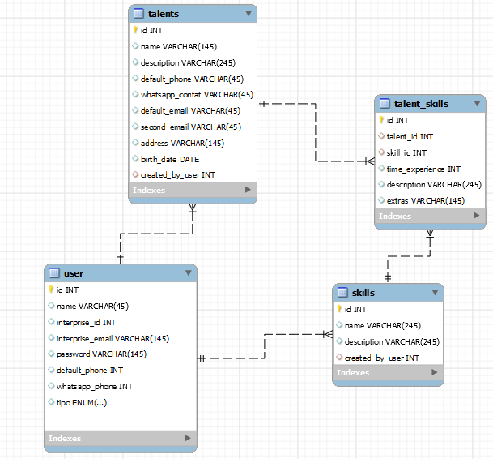

# PROJETO BANCO DE TALENTOS 

> Funcionalidades Principais
> CRUD de Dados de Candidatos

:heavy_check_mark: O sistema oferece operações completas de CRUD (Create, Read, Update, Delete) para os dados essenciais dos candidatos, incluindo:

- :heavy_check_mark: Nome
- :heavy_check_mark: Contato
- :heavy_check_mark: Experiência Profissional
- :heavy_check_mark: Educação
- :heavy_check_mark: Certificações

🚀 Além destes, o usuário pode inserir dados adicionais, como:

- :heavy_check_mark: Habilidades
- :heavy_check_mark: Localização (Cidades, Estados)
- :heavy_check_mark: Área de Atuação
- :heavy_check_mark: Objetivo Principal
- :heavy_check_mark: Facilitar o processo de recrutamento, proporcionando um ambiente intuitivo e eficiente para recrutadores gerenciarem talentos. Isso torna mais simples para os candidatos se candidatarem e   destacarem suas habilidades, ao mesmo tempo em que oferece aos recrutadores uma ferramenta eficaz para identificar talentos.

> Objetivos Secundários

- :heavy_check_mark: Pesquisa e Filtro: Implementação de funcionalidades de pesquisa avançada e filtros, permitindo aos recrutadores encontrar talentos de maneira rápida e precisa.

- :heavy_check_mark:Criação de Perfil pelo Candidato: Os candidatos têm a capacidade de criar perfis detalhados, destacando suas habilidades, experiências e qualificações de maneira abrangente.

- :heavy_check_mark:Avaliação de Perfil pelos Recrutadores: Recrutadores podem avaliar os perfis dos candidatos, simplificando o processo de seleção e tomada de decisões informadas.

> modelo entidade relacionamento

## tecnologias usadas:

## 🤝 Desenvolvedor

> Software Engineer

<table align="center">
  <tr>
    <td align="center">
      <a href="">
         
        
          <b>Erick Rodrigues</b>
        
      </a>
    </td>
  </tr>
</table>

## 📝 Licença

Este projeto está sob licença. Consulte o arquivo [LICENSE](LICENSE) para obter mais detalhes.

&#xa0;

<a href="#top">Volte para o topo</a>